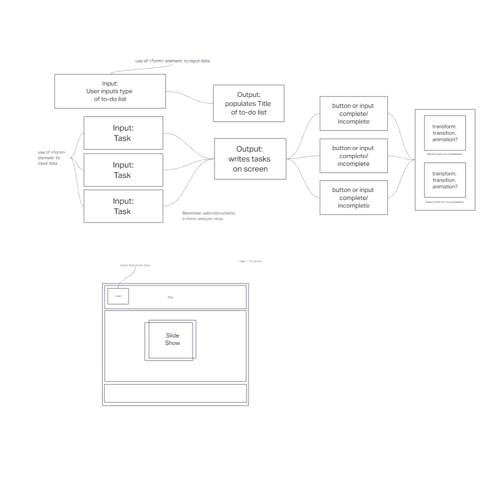

# MASTn28

## Team Members

- [Angela DeLeon](https://github.com/aedeleon2023)
- [Manuch Sadri](https://github.com/mcsaadri)
- [Tom Taylor](https://github.com/tomgtaylor)

## Name of Project: TO DO OR NOT TO DO

## Description

- Project will be an app that allows users to create their own to do list, and seeks to make it customizable for users.
- Stretch goal: make to do list sharable with other users of the app.

<!-- Table of contents -->

## Team Dynamics

[Link to Team Dynamics](teamdynamics.md)

## User Stories

[Link to User Stories](userstories.md)

## Wireframe

[Link to Wireframe](wireframe.html)

Hello.

<!-- 

<!--  -->
